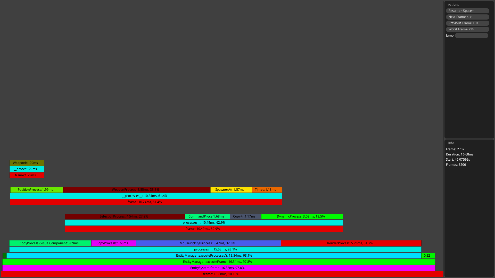

============
Despiker 0.1
============

.. image:: https://raw.githubusercontent.com/kiith-sa/despiker/master/code.dlang.org-shield.png
   :target: http://code.dlang.org

**Note**: while somewhat usable, Despiker is extremely experimental and unstable. For
example, at the moment Despiker *does not* handle invalid profiling data and will crash
with an assertion failure if it receives such data. Also, Despiker is likely to see only 
sporadic development until second half of 2015.

------------
Introduction
------------

Despiker (`video <http://defenestrate.eu/docs/despiker/_static/despiker.webm>`_) is
a graphical real-time frame-based profiler for the `D programming language
<http://dlang.org>`_ based on the `Tharsis.prof
<https://github.com/kiith-sa/tharsis.prof>`_ library.

A frame-based profiler is a specialized profiling tool for interactive programs such as
games, hence *frame* - an iteration of an event loop.  Unlike a traditional profiler,
which aggregates time spent in various parts of code, a frame-based profiler keeps track
of time spent in each individual frame separately.

This allows to find not only *where* overhead occurs, but *when* it occurs.  A frame-based
profiler can find the exact frame when overhead was unexpectedly high (manifesting in
a sharp FPS decrease, or lag), which would get averaged out with a normal profiler.  It
also allows to view how overhead in various parts of code evolves over time as the program
(game) runs.

Note that to use Despiker, you need to instrument parts of your code with `Tharsis.prof
<https://github.com/kiith-sa/tharsis.prof>`_. This is explained in detail in the `tutorial
<http://defenestrate.eu/docs/despiker/tutorials/getting_started.html>`_.

For more in-depth background on frame-based profiling, see blog posts about development of
Tharsis.prof, the base library behind Despiker:

* `Frame-based game profiling <http://defenestrate.eu/2014/09/05/frame_based_game_profiling.html>`_
* `Optimizing memory usage of a frame-based profiler <http://defenestrate.eu/2014/09/05/optimizing_memory_usage_of_a_frame_based_profiler.html>`_
* `Frame-based profiling with D ranges <http://defenestrate.eu/2014/09/05/frame_based_profiling_with_d_ranges.html>`_

Despiker is a work in progress and *will* see interface and compatibility breaking changes
in future.

---------------
Getting started
---------------

See the `tutorial <http://defenestrate.eu/docs/despiker/tutorials/getting_started.html>`_.

------------
Requirements
------------

Despiker should run on any platform with *OpenGL 3.3* or newer, as long as there is
a D compiler and a version of `SDL <libsdl.org>`_ for that platform.  Despiker has only
been tested on x86-64 Linux so far, and there are no official builds for other platforms
yet.

If you encounter a problem getting Despiker to compile or run (see `tutorial
<http://defenestrate.eu/docs/despiker/tutorials/getting_started.html>`_) on Windows, OSX
or another platform, you are welcome to `report a bug
<https://github.com/kiith-sa/despiker/issues/new>`_.  You and even more welcome to `fork
<https://github.com/kiith-sa/despiker/fork>`_ Despiker and create a pull request,
especially if you want that problem solved *now* instead of *in a few months*.

--------
Features
--------

* `Tutorial <http://defenestrate.eu/docs/despiker/tutorials/getting_started.html>`_.
* (Somewhat, see above) cross-platform. Should work at least on Linux, Windows and OSX.
* Can profile a game in real-time as it runs, or afterwards, using dumped profiling data.
* Allows the user to move forward and backward between frames 
* Can be used to profile multi-threaded code (using one Tharsis.prof `Profiler
  <http://defenestrate.eu/docs/tharsis.prof/tharsis.prof.profiler.html>`_ per thread,
  as long as frames are consistent in all profiled threads.
* Can view variable values recorded by Tharsis.prof.
* Quick button to find the slowest frame (yes, not very sophisticated for now).
* GUI and main functionality are separate to make it easy to write new GUI frontends.
* GUI can be controlled almost fully from keyboard.

--------
Controls
--------

========================= ===========================================
Control                   Action
========================= ===========================================
``Space``                 Pause/resume current (real-time) frame view
``H``/``L``               Previous/next frame
``W``/``D``, ``RMB`` drag Panning
``-``/``+``, mouse wheel  Zooming
``1``                     Jump to the worst/slowest frame
========================= ===========================================

-------------------
Directory structure
-------------------

===============  =======================================================================
Directory        Contents
===============  =======================================================================
``./``           This README, utility scripts.
``./doc``        Documentation.
``./docsrc``     Documentation sources.
``./source``     Source code.
===============  =======================================================================

-------
License
-------

Despiker is released under the terms of the `Boost Software License 1.0
<http://www.boost.org/LICENSE_1_0.txt>`_.  This license allows you to use the source code
in your own projects, open source or proprietary, and to modify it to suit your needs.
However, in source distributions, you have to preserve the license headers in the source
code and the accompanying license file.

Full text of the license can be found in file ``LICENSE_1_0.txt`` and is also
displayed here::

    Boost Software License - Version 1.0 - August 17th, 2003

    Permission is hereby granted, free of charge, to any person or organization
    obtaining a copy of the software and accompanying documentation covered by
    this license (the "Software") to use, reproduce, display, distribute,
    execute, and transmit the Software, and to prepare derivative works of the
    Software, and to permit third-parties to whom the Software is furnished to
    do so, all subject to the following:

    The copyright notices in the Software and this entire statement, including
    the above license grant, this restriction and the following disclaimer,
    must be included in all copies of the Software, in whole or in part, and
    all derivative works of the Software, unless such copies or derivative
    works are solely in the form of machine-executable object code generated by
    a source language processor.

    THE SOFTWARE IS PROVIDED "AS IS", WITHOUT WARRANTY OF ANY KIND, EXPRESS OR
    IMPLIED, INCLUDING BUT NOT LIMITED TO THE WARRANTIES OF MERCHANTABILITY,
    FITNESS FOR A PARTICULAR PURPOSE, TITLE AND NON-INFRINGEMENT. IN NO EVENT
    SHALL THE COPYRIGHT HOLDERS OR ANYONE DISTRIBUTING THE SOFTWARE BE LIABLE
    FOR ANY DAMAGES OR OTHER LIABILITY, WHETHER IN CONTRACT, TORT OR OTHERWISE,
    ARISING FROM, OUT OF OR IN CONNECTION WITH THE SOFTWARE OR THE USE OR OTHER
    DEALINGS IN THE SOFTWARE.

-------
Credits
-------

Despiker was created by Ferdinand Majerech aka Kiith-Sa kiithsacmp[AT]gmail.com .

Parts of code based on `gfm <https://github.com/d-gamedev-team/gfm>`_ created by Games
from Mars.

Despiker was created using Vim and DMD on Linux Mint as a real-time game profiler for `D
<http://www.dlang.org>`_. See more D projects at `code.dlang.org
<http://code.dlang.org>`_.
